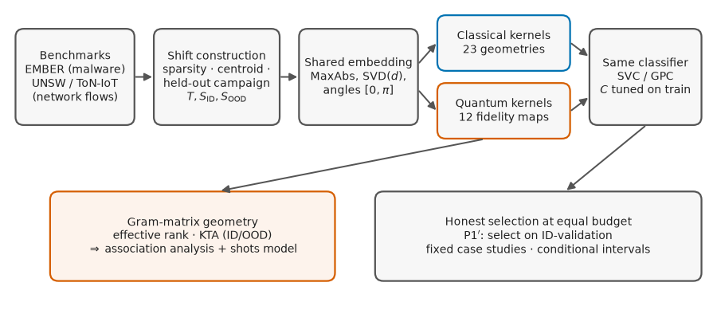
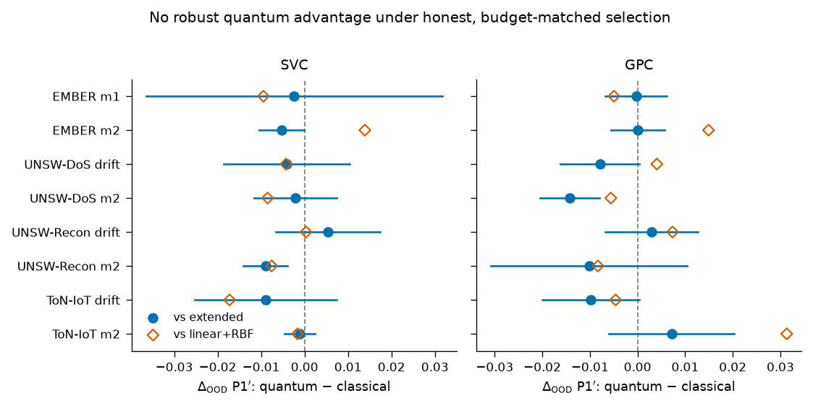
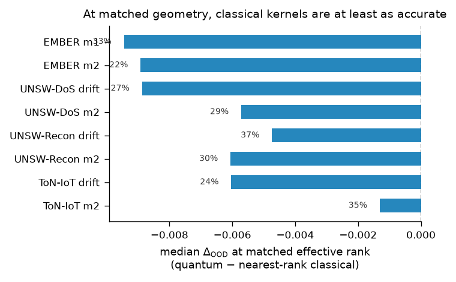

# Controlled Kernel Evaluation under Distribution Shift

[](https://github.com/roberto-fernandez-barrios/kernel_shift_framework/actions/workflows/ci.yml)
[](LICENSE)
[](https://github.com/roberto-fernandez-barrios/kernel_shift_framework/releases)
[](https://doi.org/10.5281/zenodo.19147649)

Reproducible framework for the **controlled comparison of quantum and classical kernels under distribution shift** — the artifact behind the manuscript:

> **Quantum and Classical Kernels under Distribution Shift: A Controlled Study of Kernel Geometry and Out-of-Distribution Robustness**

Within each experimental setting, the classifier, preprocessing, and splits are held fixed; **only the kernel changes**. Every configuration's regularization is tuned on training data alone, configurations are selected without out-of-distribution labels, and both families search an equal candidate budget.



## The study at a glance

- **4 benchmark scenarios, 2 modalities**: EMBER (static PE malware), UNSW-NB15 (DoS, Reconnaissance) and ToN-IoT (Scanning) network flows.
- **2 shift mechanisms**: constructed covariate-shift splits, and a **held-out attack-campaign shift** on network traffic (unseen attack campaign + capture-partition change).
- **2 classifier families** consuming the same precomputed Gram matrices: SVC and a Laplace-approximation **Gaussian process classifier** (whose calibration under shift is assessed, not assumed).
- **35 kernel geometries** (23 classical + 12 fidelity feature maps) with symmetric length-scale tuning and per-configuration `C` tuned by cross-validation on train; **equal candidate budgets**.
- **8 scenario-groups × 15 pipeline realizations**, evaluated under **honest ID-validation selection** (P1′), reported as **fixed case studies with conditional intervals** — no population *p*-value.
- **Finite-shot fidelity-estimation model** to test how far the statevector-exact geometry transfers to finite measurement.

## Key findings



1. Under the **test-peeking oracle selection and fixed regularization** that dominate the optimistic literature, fidelity kernels appear to beat linear+RBF baselines by up to $+0.037$ OOD balanced accuracy.
2. **That advantage is an evaluation artefact.** Once each configuration's `C` is tuned on training data alone, selection uses **no OOD labels** (an ID-validation split), and budgets are matched, the OOD difference collapses to near zero against **both** references — dataset-equal-weighted $\Delta_{\mathrm{OOD}}\approx-0.004$ vs linear+RBF and vs the extended classical family — classical-favoured or tied in **7 of 8 scenario-groups**.
3. **At matched effective rank the classical kernels are at least as accurate in every scenario-group.** The geometry that carries information about robustness (effective rank, OOD alignment) is a **regime-dependent association**, not a governing law, and it favours neither family.
4. A **finite-shot analysis** shows the quantum kernels' geometry is a statevector-exact idealization: effective rank inflates under finite estimation, while alignment and accuracy survive.

**Bottom line:** under a fair, budget-matched, honestly selected comparison, fidelity-based quantum kernels show **no robust out-of-distribution advantage** over well-tuned classical kernels; a short-length-scale Laplacian is a strong, cheap baseline.



## Repository layout

```text
src/
  utils/ember/       EMBER export + master/q-split construction
  utils/netflow/     network-flow export + shift constructions (m2-centroid, natural)
  experiments/       kernel-swap runners (classical, quantum, extended+GPC)
  analysis/          kernel-geometry descriptors (eff. rank, KTA, geometric difference)
scripts/
  ember/  netflow/   grid drivers (settings x seeds x sizes)
  analysis/          family comparisons, Wilcoxon, mechanism tests
  reporting/         every table and figure of the paper, generated from results/
results/             frozen aggregated results, tables_v2/, kernel_geometry/, mechanism/
manuscript/          LaTeX source (Springer sn-jnl), figures, cover letter
```

## Reproducing

```bash
conda env create -f environment.yml && conda activate kernel-shift-framework

# 1) EMBER grid (masters + q-splits + geometry), then extended kernels + GPC
python scripts/analysis/run_kernel_geometry_grid.py --save-spectra
python scripts/ember/run_extended_kernels_grid.py --qsplit-seeds 42 123 999 7 2024 --model-seeds 42 123 999

# 2) Network-flow grid (exports, shift splits, runners, geometry)
python scripts/netflow/run_netflow_grid.py --qsplit-seeds 42 123 999 7 2024 --model-seeds 42 123 999

# 3) Analyses, tables, and figures of the paper
python scripts/analysis/compare_extended_families.py
python scripts/analysis/mechanism_generalization.py
python scripts/reporting/make_v2_tables.py
python scripts/reporting/make_v2_figures.py
```

Raw EMBER (2018, feature version 2) must be placed under `data/raw/ember/`; the network-flow scenarios are exported from the public UNSW-NB15 and ToN-IoT benchmarks (see `src/utils/netflow/`). A label-leakage sanity check is included (`scripts/netflow/check_label_leakage.py`).

## Manuscript and citation

The manuscript source lives in [`manuscript/`](manuscript/) (Springer Nature format; an IEEEtran conversion script is provided under `scripts/reporting/`). If you use this software, please cite it via [`CITATION.cff`](CITATION.cff) (Zenodo DOI: [10.5281/zenodo.19147649](https://doi.org/10.5281/zenodo.19147649)).

## License

BSD-3-Clause. Benchmark datasets remain subject to their original licenses.
