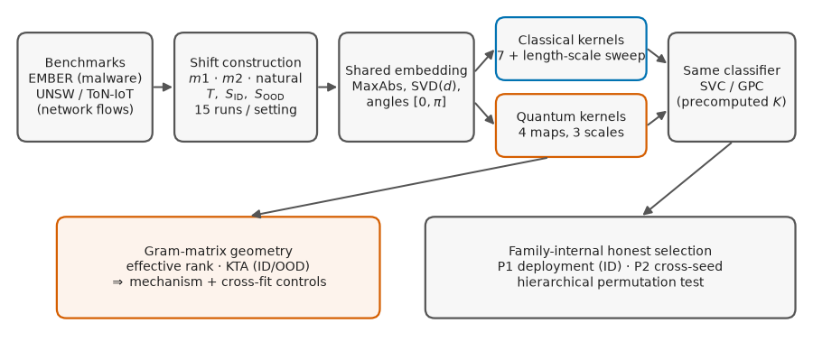
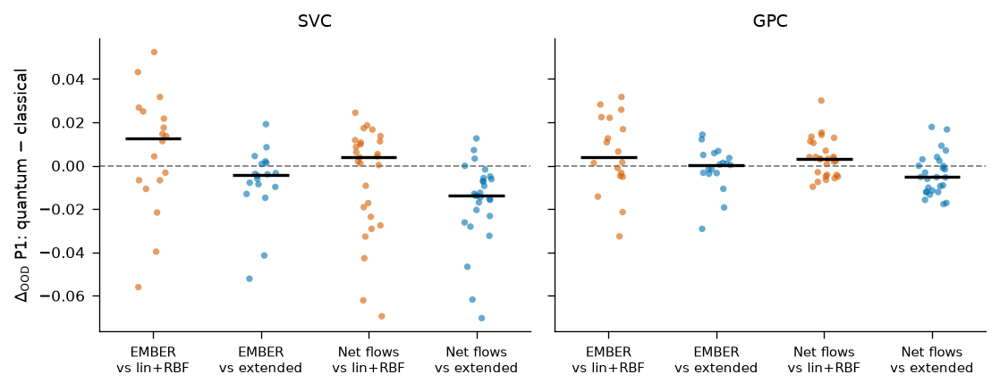
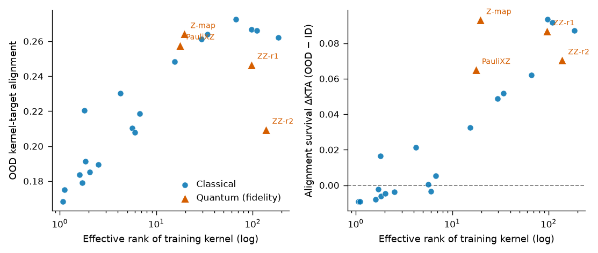

# Controlled Kernel Evaluation under Distribution Shift

[](https://github.com/roberto-fernandez-barrios/kernel_shift_framework/actions/workflows/ci.yml)
[](LICENSE)
[](https://github.com/roberto-fernandez-barrios/kernel_shift_framework/releases)
[](https://doi.org/10.5281/zenodo.19147649)

Reproducible framework for the **controlled comparison of quantum and classical kernels under distribution shift** — the artifact behind the manuscript:

> **Quantum and Classical Kernels under Distribution Shift: A Controlled Study of Kernel Geometry and Out-of-Distribution Robustness**

Within each experimental setting, the classifier, preprocessing, splits, model-selection logic, and length-scale tuning freedom are held fixed; **only the kernel changes**.



## The study at a glance

- **4 benchmark scenarios, 2 modalities**: EMBER (static PE malware), UNSW-NB15 (DoS, Reconnaissance) and ToN-IoT (Scanning) network flows.
- **3 drift mechanisms**: within-class sparsity extremes ($m1$), train-geometry extremes ($m2$), and **natural regime drift** on network traffic.
- **2 classifier families** consuming the same precomputed Gram matrices: SVC and a Laplace-approximation **Gaussian process classifier** (calibrated uncertainty under shift).
- **11+ kernels** plus a **length-scale sweep** applied symmetrically: linear, RBF, polynomial, Laplacian, Matérn (median heuristic) with $\ell$ factors, + 4 fidelity feature maps with angle scales (115 classical vs. 60 quantum configurations).
- **72 principal settings × 15 repeated runs**, evaluated under **honest, no-OOD-label selection** (P1 deployment, P2 cross-seed) alongside the oracle (P3), with per-scenario Wilcoxon tests and a **hierarchy-aware permutation test**.
- **Kernel-geometry analysis**: effective rank, centered kernel-target alignment (ID/OOD), with **label-permutation and cross-fitting controls** against circularity.

## Key findings



1. Against the customary **linear+RBF baselines**, fidelity-based quantum kernels improve OOD balanced accuracy nearly uniformly — the result the optimistic literature reports.
2. **That advantage does not survive a fair test.** Once the classical family is enlarged with heavy-tailed kernels given the **same length-scale freedom**, and configurations are selected **without consulting the shifted labels**, the OOD advantage **dissolves on EMBER and reverses on network flows** (the extended classical family wins the deployment comparison; hierarchical permutation $p=2\times10^{-4}$ under SVC). The quantum maps survive only against the restricted linear+RBF baseline.
3. **The operative property is geometry, not quantumness.** OOD kernel-target alignment is ordered by the **effective rank of the training kernel**, identically across both families (median within-setting Spearman $\rho\approx0.93$ on EMBER, and $\approx0.96$ within the classical family alone); the fidelity maps sit in the *middle* of this classical continuum. The kernel that closes the gap is a **short-length-scale Laplacian** — exactly what the mechanism predicts. The mechanism survives label-permutation and cross-fitting controls.
4. **What remains** as a distinct quantum contribution is **in-distribution separability**, which no classical kernel we tried reproduces.



## Repository layout

```text
src/
  utils/ember/       EMBER export + master/q-split construction
  utils/netflow/     network-flow export + shift constructions (m2-centroid, natural)
  experiments/       kernel-swap runners (classical, quantum, extended+GPC)
  analysis/          kernel-geometry descriptors (eff. rank, KTA, geometric difference)
scripts/
  ember/  netflow/   grid drivers (settings x seeds x sizes)
  analysis/          family comparisons, Wilcoxon, mechanism tests
  reporting/         every table and figure of the paper, generated from results/
results/             frozen aggregated results, tables_v2/, kernel_geometry/, mechanism/
manuscript/          LaTeX source (Springer sn-jnl), figures, cover letter
```

## Reproducing

```bash
conda env create -f environment.yml && conda activate kernel-shift-framework

# 1) EMBER grid (masters + q-splits + geometry), then extended kernels + GPC
python scripts/analysis/run_kernel_geometry_grid.py --save-spectra
python scripts/ember/run_extended_kernels_grid.py --qsplit-seeds 42 123 999 7 2024 --model-seeds 42 123 999

# 2) Network-flow grid (exports, shift splits, runners, geometry)
python scripts/netflow/run_netflow_grid.py --qsplit-seeds 42 123 999 7 2024 --model-seeds 42 123 999

# 3) Analyses, tables, and figures of the paper
python scripts/analysis/compare_extended_families.py
python scripts/analysis/mechanism_generalization.py
python scripts/reporting/make_v2_tables.py
python scripts/reporting/make_v2_figures.py
```

Raw EMBER (2018, feature version 2) must be placed under `data/raw/ember/`; the network-flow scenarios are exported from the public UNSW-NB15 and ToN-IoT benchmarks (see `src/utils/netflow/`). A label-leakage sanity check is included (`scripts/netflow/check_label_leakage.py`).

## Manuscript and citation

The manuscript source lives in [`manuscript/`](manuscript/) (Springer Nature format; an IEEEtran conversion script is provided under `scripts/reporting/`). If you use this software, please cite it via [`CITATION.cff`](CITATION.cff) (Zenodo DOI: [10.5281/zenodo.19147649](https://doi.org/10.5281/zenodo.19147649)).

## License

BSD-3-Clause. Benchmark datasets remain subject to their original licenses.
