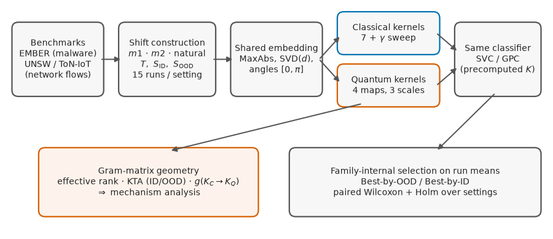
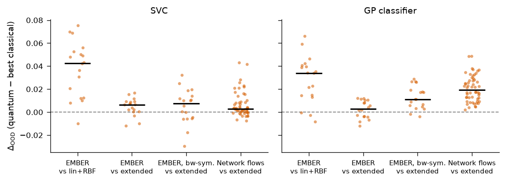
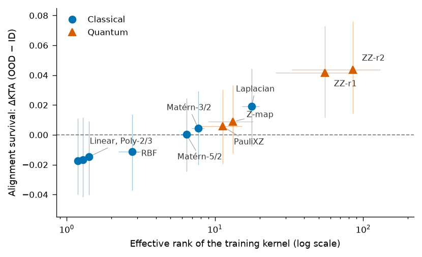

# Controlled Kernel Evaluation under Distribution Shift

[](https://github.com/roberto-fernandez-barrios/kernel_shift_framework/actions/workflows/ci.yml)
[](LICENSE)
[](https://github.com/roberto-fernandez-barrios/kernel_shift_framework/releases)
[](https://doi.org/10.5281/zenodo.19152497)

Reproducible framework for the **controlled comparison of quantum and classical kernels under distribution shift** — the artifact behind the manuscript:

> **Quantum and Classical Kernels under Distribution Shift: Kernel Geometry Governs Out-of-Distribution Robustness**

Within each experimental setting, the classifier, preprocessing, splits, model-selection logic, and bandwidth-tuning freedom are held fixed; **only the kernel changes**.



## The study at a glance

- **4 benchmark scenarios, 2 modalities**: EMBER (static PE malware), UNSW-NB15 (DoS, Reconnaissance) and ToN-IoT (Scanning) network flows.
- **3 drift mechanisms**: within-class sparsity extremes ($m1$), train-geometry extremes ($m2$), and **natural regime drift** on network traffic.
- **2 classifier families** consuming the same precomputed Gram matrices: SVC and a Laplace-approximation **Gaussian process classifier** (calibrated uncertainty under shift).
- **11+ kernels**: linear, RBF, polynomial, Laplacian, Matérn (median heuristic) + 4 fidelity feature maps — with a **symmetric bandwidth sweep** (RBF $\gamma$ factors vs. quantum angle scales).
- **72 principal settings × 15 repeated runs**, paired Wilcoxon tests with Holm correction.
- **Kernel-geometry analysis**: effective rank, centered kernel-target alignment (ID/OOD), concentration, and the geometric difference of Huang et al.

## Key findings



1. Against the customary **linear+RBF baselines**, fidelity-based quantum kernels improve OOD balanced accuracy nearly uniformly (69–71 of 72 settings; $p<10^{-9}$ on network data).
2. A median-heuristic **Laplacian kernel neutralizes the advantage on EMBER** at fixed bandwidth — the operative property is geometric, not quantum per se.
3. With **symmetric bandwidth tuning** the advantage re-emerges on EMBER, and under **natural network drift** the quantum family wins **54/54 settings** under the GP classifier ($p=1.6\times10^{-10}$).
4. One mechanism explains the pattern: **OOD accuracy tracks the survival of kernel-target alignment under shift** (positive within-setting correlation in 89–99% of 360 setting-seed units, all four datasets), with high effective rank of the training kernel as its structural precondition.



## Repository layout

```text
src/
  utils/ember/       EMBER export + master/q-split construction
  utils/netflow/     network-flow export + shift constructions (m2-centroid, natural)
  experiments/       kernel-swap runners (classical, quantum, extended+GPC)
  analysis/          kernel-geometry descriptors (eff. rank, KTA, geometric difference)
scripts/
  ember/  netflow/   grid drivers (settings x seeds x sizes)
  analysis/          family comparisons, Wilcoxon, mechanism tests
  reporting/         every table and figure of the paper, generated from results/
results/             frozen aggregated results, tables_v2/, kernel_geometry/, mechanism/
manuscript/          LaTeX source (Springer sn-jnl), figures, cover letter
```

## Reproducing

```bash
conda env create -f environment.yml && conda activate kernel-shift-framework

# 1) EMBER grid (masters + q-splits + geometry), then extended kernels + GPC
python scripts/analysis/run_kernel_geometry_grid.py --save-spectra
python scripts/ember/run_extended_kernels_grid.py --qsplit-seeds 42 123 999 7 2024 --model-seeds 42 123 999

# 2) Network-flow grid (exports, shift splits, runners, geometry)
python scripts/netflow/run_netflow_grid.py --qsplit-seeds 42 123 999 7 2024 --model-seeds 42 123 999

# 3) Analyses, tables, and figures of the paper
python scripts/analysis/compare_extended_families.py
python scripts/analysis/mechanism_generalization.py
python scripts/reporting/make_v2_tables.py
python scripts/reporting/make_v2_figures.py
```

Raw EMBER (2018, feature version 2) must be placed under `data/raw/ember/`; the network-flow scenarios are exported from the public UNSW-NB15 and ToN-IoT benchmarks (see `src/utils/netflow/`). A label-leakage sanity check is included (`scripts/netflow/check_label_leakage.py`).

## Manuscript and citation

The manuscript source lives in [`manuscript/`](manuscript/) (Springer Nature format; an IEEEtran conversion script is provided under `scripts/reporting/`). If you use this software, please cite it via [`CITATION.cff`](CITATION.cff) (Zenodo DOI: [10.5281/zenodo.19152497](https://doi.org/10.5281/zenodo.19152497)).

## License

BSD-3-Clause. Benchmark datasets remain subject to their original licenses.
