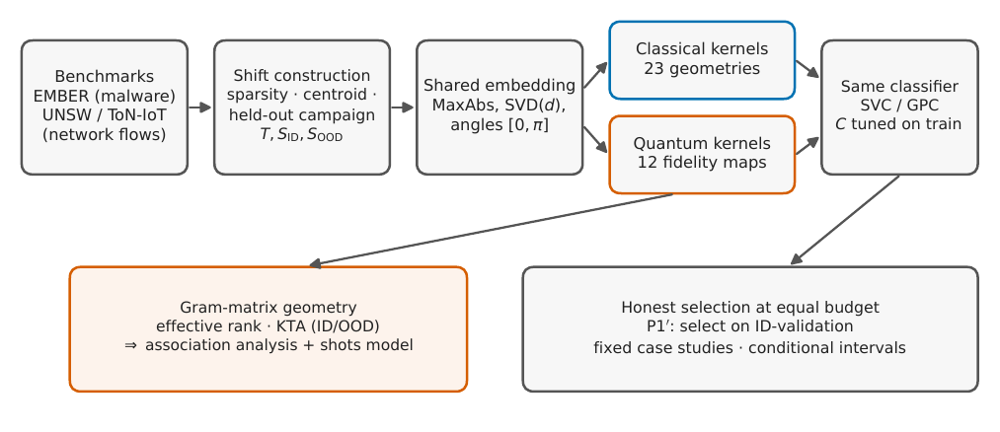
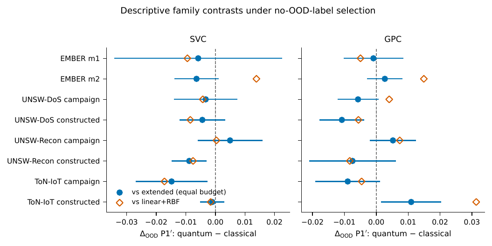
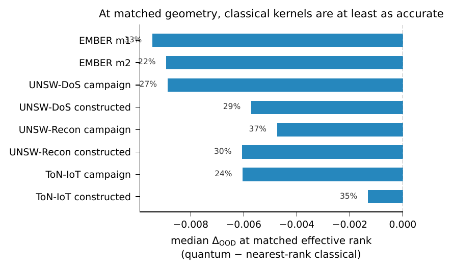
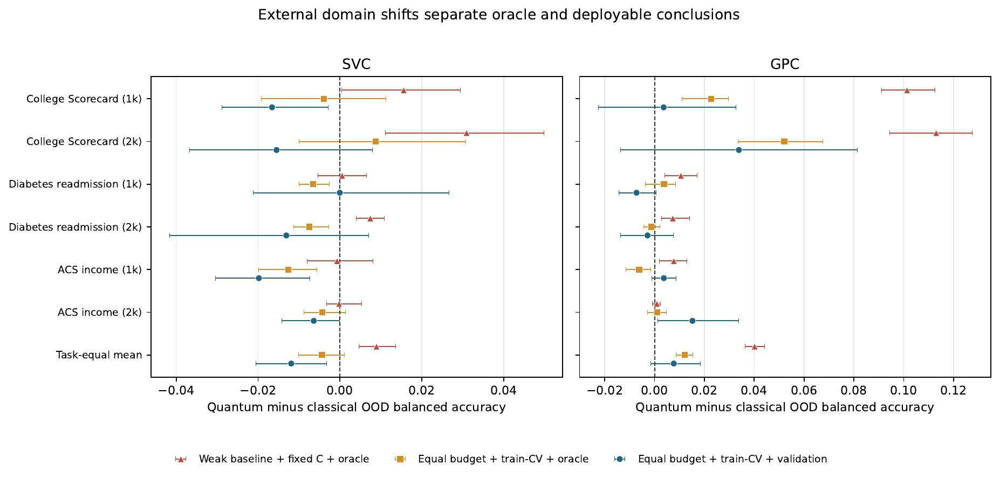

# Controlled Kernel Evaluation under Distribution Shift

[](https://github.com/roberto-fernandez-barrios/kernel_shift_framework/actions/workflows/ci.yml)
[](LICENSE)
[](https://github.com/roberto-fernandez-barrios/kernel_shift_framework/releases)
[](https://doi.org/10.5281/zenodo.19147649)

Reproducible framework for the **controlled comparison of quantum and classical kernels under distribution shift** — the artifact behind the manuscript:

> **Evaluation Choices Shape Apparent Quantum Kernel Robustness under Distribution Shift**

Within each experimental setting, the classifier, preprocessing, and splits are held fixed; **only the kernel changes**. Every configuration's regularization is tuned on training data alone, configurations are selected without out-of-distribution labels, and both families search an equal candidate budget.



## The study at a glance

- **3 source datasets, 8 fixed scenario-groups, 2 modalities**: EMBER (static PE malware), UNSW-NB15 (DoS and reconnaissance), and ToN-IoT (scanning) network flows.
- **3 shift mechanisms**: label-conditional sparsity-tail and train-centroid-tail stress tests, plus a **held-out attack-campaign shift** on network traffic (unseen attack campaign + capture-partition change).
- **2 classifier families** consuming the same precomputed Gram matrices: SVC and a Laplace-approximation **Gaussian process classifier** (whose calibration under shift is assessed, not assumed).
- **35 kernel geometries** (23 classical + 12 fidelity feature maps) with symmetric length-scale tuning and per-configuration `C` tuned by cross-validation on train; **equal candidate budgets**.
- **Circuit-aware quantum strata**: two entangling ZZ maps and two separable product maps, with logical depth/CX counts and projected finite-shot sampling resources reported explicitly.
- **5 q-split clusters per scenario-group**, each containing three model-seed realizations, evaluated under **target-label-free ID-validation selection** (P1′) and reported as fixed case studies with conditional cluster-*t* intervals — no population *p*-value.
- **Repeated finite-shot fidelity estimation** with 30 independent measurement replicates at four shot counts under an unprojected estimate, the original independent-square PSD heuristic, and a coherent train-based Nyström extension, conditional on eight fixed exact Gram matrices.
- **Prospectively frozen external validation** on College Scorecard, diabetes readmission, and ACS income, with 30 audited units and 37,800 split-level results.

## Key findings



1. Under a deliberately optimistic **test-peeking oracle selection with fixed regularization**, fidelity kernels appear to beat linear+RBF baselines by up to $+0.037$ OOD balanced accuracy.
2. Once each configuration's `C` is tuned on training data alone, selection uses **no OOD labels** (an ID-validation split), and budgets are structurally matched, the fixed cases provide no consistent evidence of a quantum advantage. Against the equal-budget extended classical family, the three-source-dataset-equal $\Delta_{\mathrm{OOD}}$ is **-0.00565 for SVC** and **-0.00094 for GPC**; against linear+RBF it is **-0.00407** and **+0.00591**, respectively. Pointwise intervals are conditional on five q-split clusters and are not equivalence tests or simultaneous intervals.
3. The circuit audit shows that two quantum maps are entangling ZZ constructions and two are separable product kernels. At matched 30-candidate budgets, their three-source-dataset-equal SVC effects are **-0.00928** and **-0.00547**, respectively; restricting the comparison to entangling maps does not uncover a positive aggregate effect.
4. In an explicitly observational nearest-rank analysis with a prespecified 1.25 caliper, **median quantum-minus-classical differences are negative in all eight scenario-groups**. The result persists under alternative calipers and one-to-one matching, but does not identify a causal family effect.
5. A within-v4 factorial changes from **+0.0131** at its fixed-`C`, same-test-oracle, customary-reference, native-budget corner to **-0.0047** under the fully controlled corner. Mean paired changes are largest for train-CV regularization and the extended reference, but a substantial interaction prevents additive or causal attribution. Removing frozen port/protocol/service-related fields changes the two-network-source mean from **-0.0031** to **-0.0245**, with strong group heterogeneity.
6. Repeated finite-shot perturbations show that effective rank is measurement-sensitive and that PSD handling can change the sign and magnitude of a fixed-run OOD deviation. The original independent-square correction is distinguished from a coherent train-based Nyström extension. The full conditional sensitivity projects **4.24 trillion shots** before device overhead; it is not a hardware simulation.
7. A historical cross-generation sensitivity map ranges from **+0.047 to -0.006** for SVC but is not used to assign effects to individual choices. On three external TableShift tasks, the controlled task-equal SVC effect is **-0.0119** (conditional 95% interval **[-0.0205, -0.0033]**) and protocol contraction is **+0.0208** (**[+0.0113, +0.0307]**), prospectively corroborating protocol sensitivity without implying a universal family ordering.

**Bottom line:** under equal candidate budgets and no-OOD-label selection, the tested fixed low-qubit cases show **no consistent evidence of an out-of-distribution advantage** for the fidelity-kernel family over well-tuned classical kernels. The circuit-aware analysis separates this empirical statement from any claim about entanglement, hardware, or computational speedup.





## Repository layout

```text
src/
  utils/ember/       EMBER export + master/q-split construction
  utils/netflow/     network-flow export + shift constructions (m2-centroid, natural)
  experiments/       kernel-swap runners (classical, quantum, extended+GPC)
  analysis/          kernel-geometry descriptors (effective rank and KTA)
scripts/
  ember/  netflow/   grid drivers (settings x seeds x sizes)
  analysis/          family comparisons, fixed-case inference, mechanism tests
  reporting/         every table and figure of the paper, generated from results/
results/             frozen per-run summaries and versioned derived outputs
manuscript/          main and Supplementary LaTeX/PDF, figures, cover letters
```

## Reproducing

```bash
conda env create -f environment.yml && conda activate kernel-shift-framework

# Rebuild the provenance audit, confirmatory analysis, tables, and figures
# from the 1080 frozen v4 per-run summaries.
python scripts/reproduce_v4.py --stage all

# Audit and reproduce the frozen specification curve and external validation.
python scripts/reproduce_v5.py --stage all

# Validate the reviewer-revision estimand, matching, budget, and shot-noise gates.
python scripts/reproduce_v6.py --stage all

# Rebuild the circuit-aware strata, within-v4 factorial, shortcut ablation,
# resource tables, reporting figure, and v0.8 integrity gates.
python scripts/reproduce_v8.py --stage all

# Verify the protocol utilities and reporting traceability (tests/ only).
python -m pytest -q
```

The reproduction commands deliberately do not rerun the expensive experiment grids; they validate and consume versioned summaries. The frozen contracts are [`docs/ANALYSIS_SPEC_V4.md`](docs/ANALYSIS_SPEC_V4.md), [`docs/EXTERNAL_VALIDATION_SPEC.md`](docs/EXTERNAL_VALIDATION_SPEC.md), [`docs/REVIEWER_REVISION_SPEC_V7.md`](docs/REVIEWER_REVISION_SPEC_V7.md), and [`docs/REVIEWER_REVISION_SPEC_V8.md`](docs/REVIEWER_REVISION_SPEC_V8.md).

## Manuscript and citation

The main manuscript and Supplementary Information live in [`manuscript/`](manuscript/) (Springer Nature-compatible main source plus a standalone Supplementary file). If you use this software, please cite it via [`CITATION.cff`](CITATION.cff) (immutable v0.8.0 DOI: [10.5281/zenodo.21717074](https://doi.org/10.5281/zenodo.21717074); all-version concept DOI: [10.5281/zenodo.19147649](https://doi.org/10.5281/zenodo.19147649)).

## License

BSD-3-Clause. Benchmark datasets remain subject to their original licenses.
